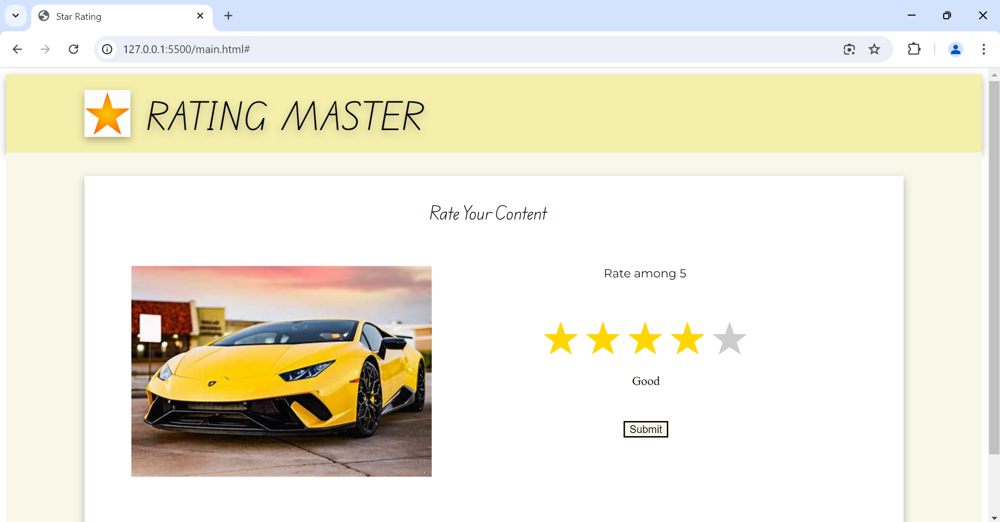

Problem Statement- Create a custom web component using the Web Components API.
Design a reusable component for a star rating system that can be embedded in any web page. 
The component should support properties for the number of stars, rating value, and an event for rating changes.

We can rate the content in this webpage. If we click any star, all the stars behind it (including current) gets coloured and we get remark printed (1 star -> Very Bad, 2 star -> Bad, 3 star -> Average, 4 star -> Good, 5 star -> Very Good).

